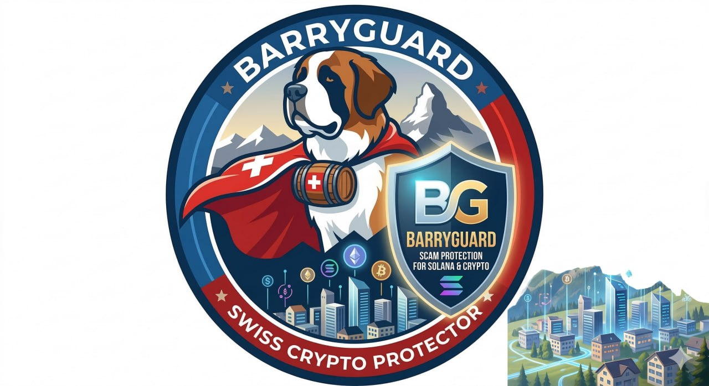

<div align="center">
  

  # BarryGuard

  **Solana Token Risk Analyzer — Browser Extension**

  [](https://chromewebstore.google.com/detail/barryguard/gbhbbdklmekgcficbhamoifelomoebpi)
  [](#license)

  *Real-time scam detection for Solana tokens on supported platforms*
</div>

---

## Overview

BarryGuard is a Chrome/Brave extension that analyzes Solana tokens in real time and overlays risk scores directly on supported Solana platforms.

The extension is a **thin client**:
- No scoring logic runs in the browser
- No direct blockchain calls are made from the extension
- All analysis is fetched from the [BarryGuard backend](https://www.barryguard.com)

This repository is public so anyone can inspect exactly what the extension does.

---

## Supported Platforms

| Platform | Status |
|----------|--------|
| Pump.fun | Live |
| PumpSwap | Live |
| Raydium | Live |
| Dexscreener | Live |
| Birdeye | Live |
| LetsBonk | Live |
| Moonshot | Live |
| Solscan | Live |
| Bags | Live |

---

## Features

### Color-Coded Risk Badges

Scores appear directly on token pages and lists:
- **Green** (`90-100`): Low risk
- **Light green** (`75-89`): Moderate risk
- **Yellow** (`55-74`): Caution
- **Orange** (`30-54`): High risk
- **Red** (`0-29`): Danger

### Security Checks

The extension surfaces check results from the BarryGuard API, including:
- Mint authority and freeze authority
- Liquidity lock status
- Top holder concentration
- Token age and holder count
- Bundle detection and insider network analysis

### Tier-Based Access

| Feature | Free | Rescue Pass | Pro |
|---------|------|-------------|-----|
| Risk badges on supported platforms | - | Yes | Yes |
| Manual token lookup (popup) | Yes | Yes | Yes |
| Score details | Yes | Yes | Yes |

### Manual Token Lookup

The popup accepts any Solana token address directly, even outside the supported platforms listed above.

---

## Installation

### From Chrome Web Store

Install from the [Chrome Web Store](https://chromewebstore.google.com/detail/barryguard/gbhbbdklmekgcficbhamoifelomoebpi).

### Build from Source

Prerequisites: [Node.js](https://nodejs.org/) and [pnpm](https://pnpm.io/)

```bash
git clone https://github.com/ZivCore/BarryGuard-Extension.git
cd BarryGuard-Extension
pnpm install
pnpm build
```

Then load in Chrome:
1. Open `chrome://extensions`
2. Enable **Developer mode**
3. Click **Load unpacked**
4. Select `.output/chrome-mv3`

---

## Development

```bash
pnpm dev              # WXT dev mode with hot reload
pnpm build            # Build extension + create release zip
pnpm build:extension  # Build unpacked extension only
pnpm typecheck        # Type-check without emitting
pnpm test             # Unit tests (Vitest)
pnpm test:e2e         # Browser smoke tests (Playwright)
```

---

## Project Structure

```
src/
  background/       Service worker (API calls, badge updates, session)
  content/          Content script bootstrap and injection logic
  entrypoints/      WXT entrypoints (background, content scripts, popup)
  platforms/        Platform adapters (one file per supported site)
  popup/            Popup UI rendering and interaction
  shared/           Types, API client, cache, token scoring
  styles/           Popup stylesheet
  config/           Platform CSS selectors
tests/              Unit and integration tests (mirrors src/)
e2e/                Playwright browser smoke tests
docs/               Chrome Web Store assets and privacy policies
public/             Static assets (icons, logos)
```

---

## API

The extension communicates exclusively with the BarryGuard API at:

```
https://www.barryguard.com/api
```

No secrets or API keys are stored in this repository. The API URL can be overridden locally via `.env.local` (see `.env.example`).

---

## Privacy

- **No wallet access**: Private keys are never requested or stored
- **No browsing tracking**: Only token addresses on supported Solana platforms are processed
- **No third-party analytics**: The extension does not include any tracking or telemetry
- **Public source**: This repository exists so anyone can verify these claims

Full privacy policy: [English](docs/privacy-policy-en.md) | [Deutsch](docs/datenschutzerklaerung.md)

---

## Disclaimer

BarryGuard provides risk indicators based on on-chain data. This is not financial advice. A low risk score does not guarantee a token is safe. Do your own research before trading.

---

## License

Source-available for transparency and security review.

This repository is public so users and reviewers can inspect the extension source code. No permission is granted to copy, modify, distribute, or reuse this code. See [LICENSE](LICENSE) for details.

---

<div align="center">

[Website](https://www.barryguard.com) · [Chrome Web Store](https://chromewebstore.google.com/detail/barryguard/gbhbbdklmekgcficbhamoifelomoebpi) · [Report an Issue](https://github.com/ZivCore/BarryGuard-Extension/issues)

</div>
